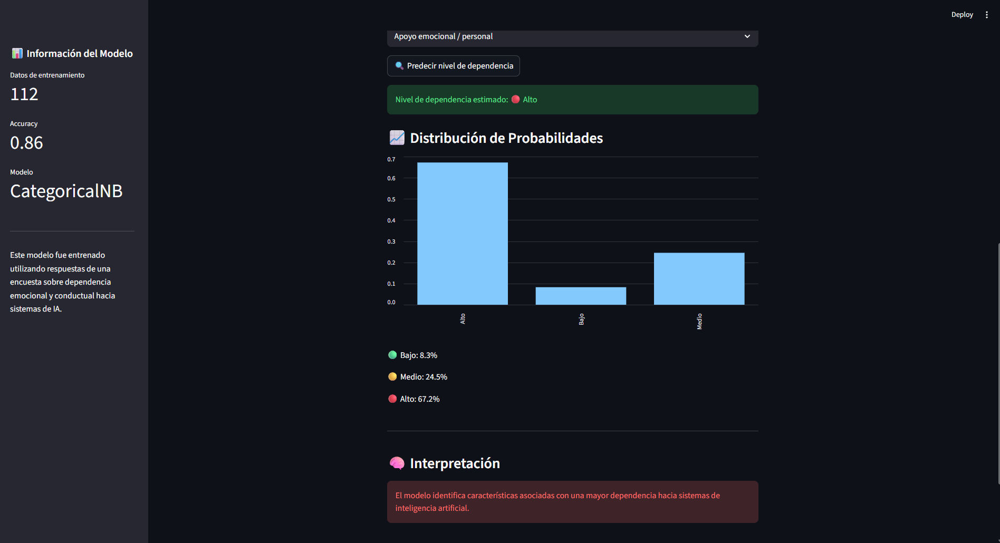
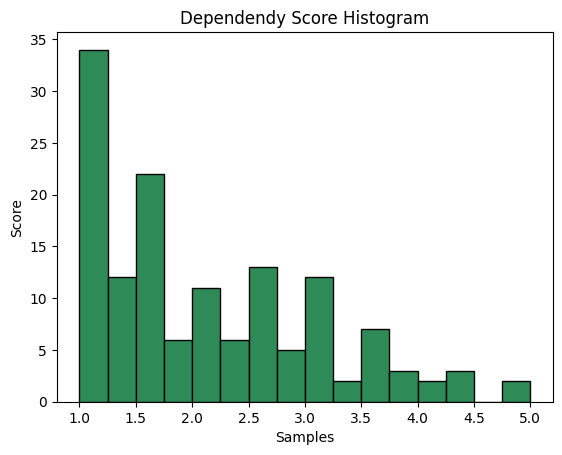

# 🤖 Human-AI Interaction Research

A statistical and machine learning study exploring behavioral and emotional dependency toward Artificial Intelligence systems.

---

## Project Overview

Recent advances in conversational AI have transformed chatbots from simple digital assistants into systems capable of providing companionship, emotional support, and highly personalized interactions. As these technologies become increasingly integrated into daily life, concerns regarding emotional attachment and dependency toward AI systems have emerged.

This project investigates behavioral and emotional dependency toward Artificial Intelligence using survey data, statistical hypothesis testing, psychometric validation, and probabilistic machine learning.

---

## Application Preview

### AI Dependency Predictor



The project includes a Streamlit application that allows users to answer behavioral questions and obtain a predicted dependency level using a trained Categorical Naive Bayes classifier.

The application provides:

* Predicted dependency level
* Class probabilities
* Model information
* Interactive user interface

---

## Research Objectives

* Measure behavioral and emotional dependency toward AI systems.
* Evaluate the reliability of dependency-related survey items.
* Investigate whether higher AI usage is associated with greater dependency.
* Analyze the relationship between social interaction and dependency levels.
* Build a probabilistic classifier capable of predicting dependency categories.

---

## Dataset

The dataset was collected through a questionnaire administered to 140 participants.

The survey included:

* 15 total questions
* 6 Likert-scale questions measuring AI dependency
* Behavioral questions regarding AI usage
* Social interaction indicators
* Emotional support and advice-seeking behaviors

A dependency score was constructed by averaging the six Likert-scale items and later categorized into:

* Low Dependency
* Medium Dependency
* High Dependency

---

## Methodology

### Psychometric Validation

Internal consistency of the dependency scale was evaluated using Cronbach's Alpha.

**Result:**

* Cronbach Alpha = 0.869

---

### Statistical Analysis

The following statistical methods were applied:

* Confidence Interval Estimation
* Welch's Independent Samples t-Test
* Chi-Squared Test of Independence

---

### Machine Learning

A Categorical Naive Bayes classifier was trained using behavioral features:

* Daily AI usage
* Frequency of social interaction
* AI usage frequency
* Emotional support usage
* Advice-following behavior
* Help-seeking preferences
* Primary use of AI

---

## Results

### Statistical Findings

- Welch's t-test revealed a statistically significant difference in dependency scores between high-usage and low-usage AI users (p = 0.003).
- The chi-squared test between social interaction frequency and dependency level produced a marginal result (p = 0.053), suggesting only weak evidence of association.
- The dependency scale demonstrated strong internal consistency (Cronbach's α = 0.869).

### Classification Performance

| Metric           | Value                   |
| ---------------- | ----------------------- |
| Accuracy         | 0.86                    |
| Model            | Categorical Naive Bayes |
| Training Samples | 112                     |
| Test Samples     | 28                      |

---

## Research Visualizations

### Dependency Score Distribution



### Confusion Matrix


---

## Project Structure
```text
AI-Dependency-Analysis/
│
├── data/
│   ├── raw/
│   │   └── relationships_ai.csv
│   │
│   └── clean/
│       ├── categorical_data.csv
│       ├── processed_data.csv
│       └── target_data.csv
│
├── notebooks/
│   ├── 01-Introduction.ipynb
│   ├── 02-EDA.ipynb
│   ├── 03-Statistical_Analysis.ipynb
│   └── 04-Naive_bayes.ipynb
│
├── paper/
│   ├── Human-AI_Interaction.tex
│   ├── Human-AI_Interaction.pdf
│   ├── dependency_histogram.png
│   ├── chi_square_heatmap.png
│   ├── test_distribution.png
│   └── confusion_matrix.png
│
├── src/
│   ├── app.py
│   └── dependency_model.pkl
│
├── README.md
└── requirements.txt
```
---

## Technologies Used

* Python
* Pandas
* NumPy
* Scikit-Learn
* Streamlit
* Matplotlib
* SciPy
* LaTeX

---

## Key Concepts

* Probability and Statistics
* Hypothesis Testing
* Confidence Intervals
* Cronbach Alpha
* Naive Bayes Classification
* Human-AI Interaction
* Survey-Based Research

---

## Running the Application

Clone the repository:

```bash
git clone https://github.com/Leop-SR/Human-AI-Interaction-Research.git
cd Human-AI-Interaction-Research
```

Install dependencies:

```bash
pip install -r requirements.txt
```

Run the Streamlit application:

```bash
streamlit run src/app.py
```

---
