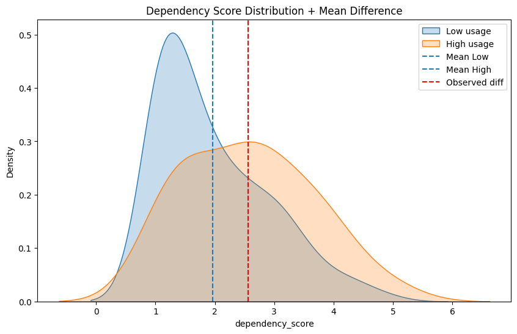
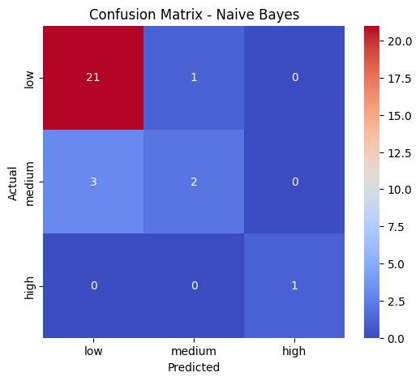

# AI Dependency Behavior Analysis

This project explores behavioral and emotional dependency toward Artificial Intelligence systems using survey data, statistical inference, and machine learning.

It combines **psychometrics, hypothesis testing, and Naive Bayes classification** to understand how human behavior relates to AI usage patterns.

---

## Project Overview

- Dataset: 140 university students (ages 18–24)
- Instrument: 15-question survey
- 6 Likert-scale items (dependency score)
- 9 categorical behavioral variables
- Goal: analyze and predict AI dependency levels

---

## Methodology

The study includes:

- Psychometric validation (Likert-based dependency score)
- Statistical inference:
  - t-test (AI usage vs dependency)
  - Chi-square test (social interaction vs dependency)
- Probabilistic modeling:
  - Categorical Naive Bayes classifier

---

## Key Results

- Significant difference in dependency by AI usage (p = 0.003)
- Weak association between social interaction and dependency (p = 0.053)
- Naive Bayes accuracy: **0.86**
- Model bias toward low dependency due to class imbalance

---

## Visualizations

### 1. Distribution of Dependency Scores

---

### 2. Confusion Matrix (Naive Bayes Model)

---

## Machine Learning Model

A Categorical Naive Bayes classifier was trained using behavioral features such as:

- AI usage frequency
- Social interaction level
- Emotional support from AI
- Preference for AI advice
- Primary usage type

The model assumes conditional independence between features and computes class probabilities using Bayes' theorem.

---

## Key Insight

AI usage frequency is a stronger predictor of dependency than social interaction within this dataset.

---

## Limitations

- Small and imbalanced dataset
- Self-reported survey bias
- Overlapping behavioral categories
- Limited high-dependency samples

---

## Project Structure
├── data/
├── notebooks/
├── images/
│ ├── dependency_distribution.png
│ └── confusion_matrix.png
├── README.md
